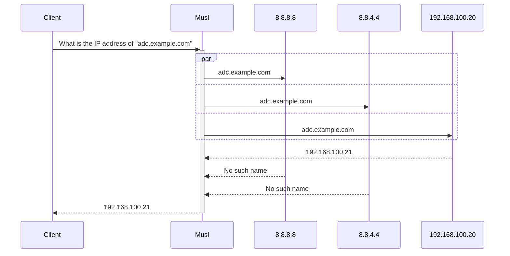
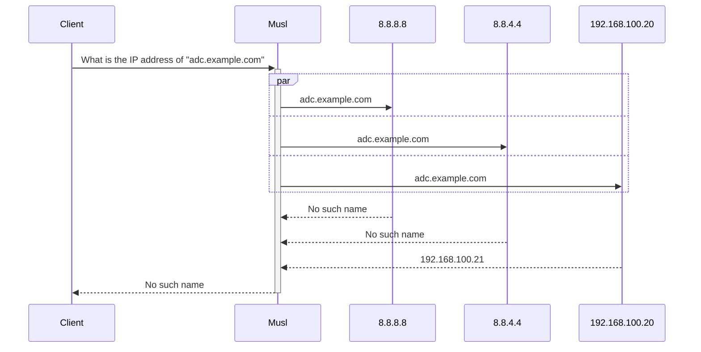

> It’s not DNS  
There’s no way it’s DNS  
It was DNS  

Son zamanlarda müşteri ortamlarında yaşadığımız problemler dönüp dolanıp `DNS`'e çıkmaya
başladı. Durum böyle olunca sorunları ve kullandığımız teknolojilerin, davranışlarını incelemek şart oldu.
Konuya uygun bir başlık ararken, `sorun hep DNS` gibi bir arama yaptığımda yukarıdaki alıntı ile ilk defa karşılaştım.

`DNS` ile ilgili benzer sorunları yaşayan bir [arkadaş](https://twitter.com/broskiFGC/status/1298385922791276551?lang=en) , sistem yöneticileri için `Reddit` üzerinde sanırım [bu konuda](https://www.reddit.com/r/sysadmin/comments/4oj7pv/network_solutions_haiku/) bir 
kartpostal hazırlamış ve bu da oldukça meşhur olmuş. Birçok insan benzer sorunları yaşadığı için tabi alıntı almış başını yürümüş

## DNS Neden Önemli?

Kullandığımız web siteleri, geliştirdiğimiz platformlar, kullandığımız işletim sistemleri, çağırdığımız API yöntemleri, en basitinden
__IP__ adresi yerine, genellikle isimlerle çalışıyor. Ama modern internet altyapısı IP protokolü üzerinden çalıştığı için
verilen ismin önce IP adresi çözüldükten sonra ilgili port üzerinden, bir protokol aracılığı ile geri kalan işlemler yapılıyor.
IP adresini öğrenemediğiniz durumda kalan işlemler doğal olarak gerçekleştirilemiyor.

Uygulama geliştirenler için `DNS` önemli mi? Cevap maalesef evet. Eğer bir web, network, veritabanı programlama gibi bir alanda birşeyler geliştiriyorsanız,
eninde sonunda elinizde olan ismi, adresi IP adresine dönüştürüp işleme devam etmek zorundasınız. Örneğin `NodeJS, Python` gibi bir platformda bir `HTTP Web Request`
oluşturup `REST API` çağırdınız, eğer IP kullanmıyorsanız, önce DNS protokolü ile IP adresi çözümlenecek ardından sizin işleminiz devam edecek.

Kısacası `DNS` Client-Server yapısında bir protokol olduğu için belki bir sistem yöneticisi gibi DNS Server kurup yönetmeyeceksiniz ama geliştirdiğiniz yazılımlarda 
belki siz farketmeseniz de, kullandığınız programlama dili ya da işletim sistemi aracılığı ile her zaman __DNS Client__ olarak resmin içinde olacaksınız.

## Yazılım ile DNS İlişkisi

Web geliştirici olara çalışıyorsunuz ve aşağıdaki gibi bir kod yazdınız.

```javascript
http.get({
  hostname: 'myapi.internal.com',
  port: 443,
  path: '/test',
}, (res) => {
  console.log(res);
});
```

Bu isteğin gerçekleştirilmesi için önce, ismin çözülüp IP adresinin elde edilmesi gerekiyor. Tabi `NodeJS` bunu kendi başına yapmıyor, öncelikle 
çalıştığı işletim sistemi üzerinden isim çözme ile ilgili sunular fonksiyonları kullanarak bunu yapıyor ve ardından işleme devam ediyor. 
İşletim sisteminin ilgili fonksiyonlar deyince, tabi çekirdek olarak farklı fonksiyonlara, farklı soket katmanlarına sahip olsalar da, `NodeJS, Python` gibi
platformlar işletim sistemlerinin sistem çağrılarını kullanmak yerine arada soyutlama katmanı olarak kullanılan genellikle [C Standard Library](https://en.wikipedia.org/wiki/C_standard_library) gibi kütüphaneleri kullanarak bu işlemleri yapıyorlar.

Bu arada, işletim sistemi sistem çağrıları kullanılarak da yapılabilir ama platform geliştirenler için standardı kullanmak geliştirme ve bakım maliyeti için her zaman avantajlı olduğundan,
ve standard olarak işletim sistemleri tarafından C kütüphanesi sunulduğundan, dönüp dolanıp bir türlü kurtulamadığımız C programlama diline ya da kütüphanelerine ayağımız yine dolaşıyor. 
## Linux ve C Standart Kütüphaneleri

`FreeBSD, NetBSD` gibi __POSIX__ işletim sistemlerinde __LibC__ çekirdeğin bir parçası olsa da, __Linux__ dağıtımlarında çekirdeğin dışında ve kullanıcı tarafı(user space) bir
kütüphane olarak yükleniyor. Dolayısıyla farklı Linux dağıtımları farklı __LibC__ kütüphanelerine sahip olabiliyor. Tabi standart C kütüphanesinin sağlaması gereken
fonksiyonlar aynı olsa da, çalışma mantıkları farklı olabiliyor, hatta ek özellikler sunabiliyorlar. Yazılımı etkileyen en önemli kısım ise, yöntem farklılığı 
geliştirdiğiniz yazılımları etkileyebiliyor. [Bu linkten](https://www.etalabs.net/compare_libcs.html) farklı standart C kütüphanelerinin detaylı karşılaştırmalarına bakabilirsiniz.

Buraya kadar uzun bir giriş oldu farkındayım, şimdi asıl konumuza dönelim. Artık, `Docker, Kubernetes` gibi container platformlar hayatımızın parçası.
Geliştirdiğimiz ürünler, servisler bu platformlar üzerinden yayınlanıyor. Tabi artık servis sayıları fazla, ve DNS protokolü de hem dış
dünya hem de, servisler arasında iletişimin en önemli parçalarından birisi. 

## Musl ve DNS

Belki çoğumuz , container platformları işin için de olmasa, [Musl Libc](https://musl.libc.org/) ile pek işimiz olmayacak. Ama özellikle biz de birçok servisimizde
oldukça küçük boyuta sahip, güvenlik odaklı [Alpine Linux](https://www.alpinelinux.org/) tabanlı imajları kullanıyoruz. Bu Linux dağıtımı yine benzer
sebeplerle standart C kütüphanesi olarak __Musl__ kullanıyor. Yukarıda bahsettiğim, DNS çözümleme işlemi standart C kütüphanesinin sorumluluğunda olduğu için
bunun hangi mantıkta, nasıl yapıldığı uygulamalarımızı etkileyebiliyor. Peki Musl isim çözümleme işlemini nasıl yapıyor?

Linux/Unix işletim sistemlerinde standart DNS konfigürasyonu `resolv.conf` dosyası aracılığı ile yapılıyor. Standart C kütüphaneleri de bu dosyayı okuyarak içinde bulunan
`nameserver` ve diğer değerlere göre IP çözümleme işlemini yapıyorlar. Bu dosyayı tamamen yok sayıp bu işlem yapılabilir ama standartlardan konuştuğumuzu tekrar hatırlayalım.
Örnek olarak bu dosyada şöyle bir konfigürasyona sahip olduğumuzu düşünelim.

```
options edns0 trust-ad

nameserver 8.8.8.8         #Global DNS
nameserver 8.8.4.4         #Global DNS
nameserver 192.168.100.20  #Local DNS
```

Benim daha önceki kafa karışıklığım şundan kaynaklanıyordu. Buraya yazılan DNS server adreslerinin hepsinde sırayla arama işlemi yapılıp bulduğu adresi cevap olarak dönüyor sanıyordum.
Fakat o mantıkla çalışmıyor, burada olan adreslerin hepsi birbirinin yedeği gibi düşünülüyor, yani hepsinin size normalde verilen isim için aynı IP adresini çözeceği varsayılıyor.
Eğer yukarıdaki server IP adreslerinden birine ulaşımda hata alırsa, diğerlerinden gelen cevabı kabul ediyor, ama ulaşım varsa hangisinden cevap gelirse gelsin, doğru olarak kabul ediliyor.
Benim gibi, global DNS sunucularını yukarıya, local DNS sunucularını aşağıya ,yani birbirinin yedeği olmayan DNS sunucuları aynı `resolv.conf` için hangi sırayla yazarsanız yazın beklemediğiniz sonuçlarla karşılaşabilirsiniz.

Burada C kütüphaneleri içinde işleyiş de birbirinden farklı. Örnek olarak `resolv.conf` içeriği yukarıdaki gibi olan ve __Musl__ kullanan bir __Alpine__ container içinde bir CLI komutu ve basit bir __NodeJS__ kodu ile aşağıdaki gibi DNS sorgusu yapıyorum.
`nslookup` ya da `dig` gibi araçları özellikle kullanmadım, çünkü onlar bu iş için tasarlandığından dolayı resolv.conf konfigürasyonunu ya da standart C kütüphanesinin sağladığı fonksiyonları
yok sayabiliyorlar. 

```
bash-5.1# getent hosts adc.sechard.local
192.168.100.21    adc.example.local  adc.example.local


bash-5.1# cat lookup.js
const dns = require('node:dns');
dns.lookup('adc.sechard.local', (err, address, family) =>
  console.log('address: %j family: IPv%s', address, family));
  
  
bash-5.1# node lookup.js
address: "192.168.100.21" family: IPv4
```

Aşağıda bu işlem yapılırken aldığım network trafiği paketlerini görebilirsiniz.


Burada doğru cevap almamızın sebebi aslında tamamen rastlantı, internal olarak kullandığımız DNS sunucusu daha hızlı cevap verdiği için ilk ondan aldığı cevabı kabul edip bize doğru sonucu göstermiş.

Musl [dökümanında](https://wiki.musl-libc.org/functional-differences-from-glibc.html#Name-Resolver/DNS) mantığın nasıl çalıştığından bahsetmiş
ama bunu aşağıdaki gibi diyagram olarak çizersek daha rahat anlaşılır. 




Peki internal DNS sunucumuz geç cevap verse nasıl olacaktı? Hemen kendi ortamımızda bu gecikmeyi canlandıralım. Aşağıda `tc` yani traffic control komutları ile
internal DNS sunucumuz olan 192.168.100.20'ye giden paketlere 5000ms gecikme ekliyoruz, bu şekilde bize geç cevap dönmüş olacak.

```
tc qdisc add dev eth0 root handle 1: prio priomap 0 0 0 0 0 0 0 0 0 0 0 0 0 0 0 0
tc qdisc add dev eth0 parent 1:2 handle 20: netem delay 0ms
tc filter add dev eth0 parent 1:0 protocol ip u32 match ip src `hostname -i` flowid 1:2
tc qdisc add dev eth0 parent 1:1 handle 10: netem delay 5001ms
tc filter add dev eth0 parent 1:0 protocol ip prio 1 u32 match ip dst 192.168.100.20 flowid 1:1
```

Ardından daha önce yaptığımız gibi komut satırından ve kod ile yazdığımız şekilde tekrar aynı ismi çözmeye çalışalım.


```
bash-5.1# getent hosts adc.sechard.local


bash-5.1# cat lookup.js
const dns = require('node:dns');
dns.lookup('adc.sechard.local', (err, address, family) =>
  console.log('address: %j family: IPv%s', address, family));


bash-5.1# node lookup.js
address: undefined family: IPvundefined
```


Paket trafiğinden görüldüğü gibi gecikme işe yaramış, aslında bize iç sunucudan cevap gelmiş ama geç geldiği için, Musl ilk cevabı doğru kabul ederek yoluna devam etmiş ve bize, bu isim için herhangi bir adres çözemediğini belirtmiş.

Bu sefer son senaryo diyagram üzerinde aşağıdaki gibi işlemiş.




Görüldüğü gibi işletim sisteminin kullandığı C kütüphanesi ve onun çalışma mantığı DNS konusu olunca yazdığımız uygulamadan, işletim sisteminde bulunan araçlara kadar farklı şeyleri etkileyebiliyor.
Hele Docker, Kubernetes gibi platformlar için isim çözümleme oldukça kritik, gitmek istediğiniz servislere önce çözümleme yaparak işe başlıyorlar. Musl ile Glibc işleyiş ve özellikler açısından farklılık gösterebiliyor, bir sonraki yazıda
belki DNS ile alakalı diğer başımı ağrıtan Musl problemine değinirim ya da Glibc bu işe nasıl yapıyor ona bakabiliriz.
