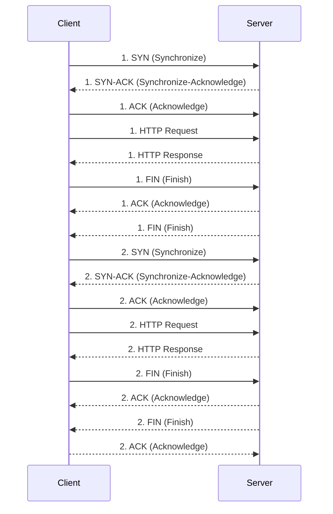
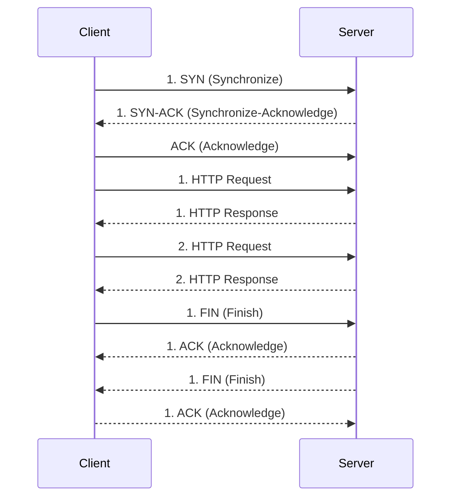
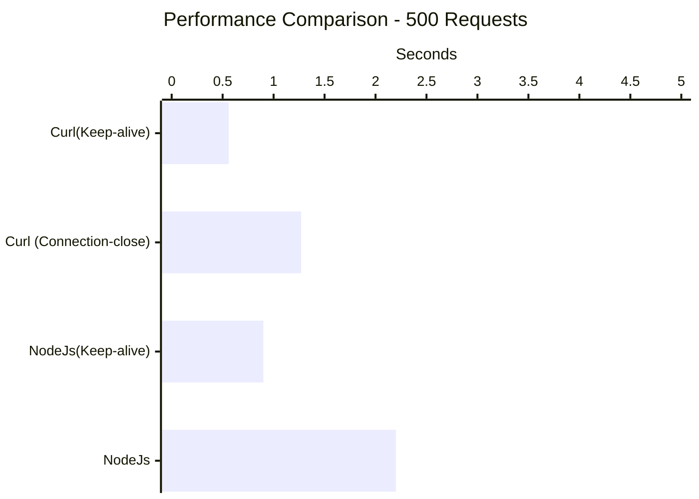

Kendisini köle gibi çalıştırıp sırtından kırbacı eksik etmediğimiz bir `HTTP` servisimiz vardı, buna `Server`
adını verelim. Yaptığımız işlerden birisi de, görev gereği bu `Server` arkadaşı birkaç dakika içinde 
yüzlerce defa çağırıp, sonuçları toparlayıp hazırlamaktı. Bunu yapan arkadaşa da bundan sonra `Client` diyelim.

Dikkat edilmesi gereken konulardan biri, hem Client hem de Server, `Backend` servis olarak çalışan bileşenler,
yani bu HTTP istekleri klasik bir tarayıcı üzerinden gönderilmiyordu. Günlerden bir gün, `Client` arkadaşın
sonuçları yeterince hızlı derleyip toparlayamadığını gözlemledik, bu sebeple konuyu derinlemesine inceleyip neler
yapabiliriz çıkardık ve belki çoğu kişinin bildiği bir konuyu farlı bir açıdan ölçmek istedim.

> Yazı boyunca kullanılan kod örneklerini [buradan](https://gist.github.com/caltuntas/c9aa264834ba4d9b05c51c999901cf6f) edilebilirsiniz.

## HTTP Request Dediğin Nedir?

HTTP bir uygulama protokolü ama gönderilen request ve response aslında `TCP` (en azından HTTP/3 haricinde diyelim) protokolü üzerinden taşınıyor.
Tarayıcınız üzerinden bir web sitesine ya da servise istek attığınızda, öncelikle karşı tarafa bir `TCP` bağlantısı açılıp
ardından `HTTP` protokolü ile ilgili olan çoğu şey `TCP` içinde `Data` kısmında gönderiliyor. 

Durum böyle olunca, HTTP konuşmak için TCP kurallarına uymak gerekiyor, ilk kurallardan biri ise [TCP three-way handshake](https://en.wikipedia.org/wiki/Handshake_(computing)).
Yani sunucu ile HTTP konuşmaya başlamadan önce TCP üzerinden el sıkışıp şartlarda anlaşmamız gerekiyor, sonra diğer işlemler takip ediyor.




Tabi istek bittiğinde de, TCP için yine bağlantıyı kapatmak için yukarıdaki gibi `termination` paketlerini de göndermek gerekiyor. 
Bu paketlerin her biri tabi hem sunucu hem de istemci tarafında az da olsa ek bir işlemci gücü ve zaman gerektiriyor. 
Az sayıda istek alan bir sunucu ya da istemci için bu paketlerin maliyeti pek göze batmazken, bizim gibi yoğun istek altında
kısa sürede işini bitirmesi gereken bir sunucu ya da istemci için oldukça önem arz edebiliyor.

## HTTP Protokol Farklılıkları

HTTP protokolleri ve kullandığı farklı bağlantı yöntemleri `Mozilla` tarafından güzel şekilde [özetlenmiş](https://developer.mozilla.org/en-US/docs/Web/HTTP/Connection_management_in_HTTP_1.x).
HTTP oldukça eski bir protokol, zamanla web kullanımı arttıkça, yukarıdaki durum için aslında çözüm geliştirilmiş ve her seferinde
TCP bağlantısı açık kapatmaktansa bu bağlantıyı koru ve aynı bağlantı üzerinden diğer isteklerini gönder demişler. 

Bu yöntemin adına ise Mozilla linkinde ki gibi `Persistent Connection` ya da namı diğer `keep-alive` deniliyor. 
Keep-alive yöntemi ile yukarıdaki gibi grafiği olan 2 adet HTTP Request/Response aşağıdaki gibi gözüküyor.




## Keep-alive Olmazsa Neler Oluyor

Basit bir Python kodu ile HTTP server oluşturalım. Protokol olarak 1.0 yerine 1.1 kullandım çünkü 1.0 
bildiğim kadarıyla `keep-alive` özelliğini desteklemiyor.

```
import http.server
import socketserver
import sys

class HttpServer(http.server.SimpleHTTPRequestHandler):
    protocol_version = "HTTP/1.1"

    def handle(self):
        self.close_connection = False
        while not self.close_connection:
            self.handle_one_request()

def run(port):
    with socketserver.TCPServer(("", port), HttpServer) as httpd:
        print("HTTP 1.1 Persistent Connections Server running at port", port)
        httpd.serve_forever()

if __name__ == "__main__":
    port = int(sys.argv[1]) if len(sys.argv) > 1 else 5000
    run(port)
```

Yukarıdaki sunucu gelen isteğe bulunduğu dizindeki dosyaların adlarını listeleyerek cevap dönüyor, bu şekilde olması iyi çünkü mümkün olduğunca basit,
başka bir konuda zaman alan bir işlem yapmıyor ve bize asıl ölçmek istediğimiz el sıkışmanın maliyetini daha iyi ortaya çıkarmamazı sağlıyor.

Benze şekilde bu sunucuya, çok sayıda istek gönderecek basit bir `curl` komutu hazırlayalım.

```
#!/bin/sh 

PROTOCOL="http"
SERVER="localhost"
PORT=5000
URL="$PROTOCOL://$SERVER:$PORT"

/usr/bin/time curl --silent -H "Connection: close"  "$URL" \
  "$URL" \
  "$URL" \
  ...
```

Curl komutunun içinde ise 500 defa aynı `URL` tekrarlandı, iki sebebi var. Birincisi her HTTP isteği için
yeniden bir curl process oluşturmak ayrı süre alacağı için bundan kaçınmak istedim, ikincisi ise `keep-alive` özelliğini kullanmak
için istekleri aynı curl process içinde göndermek gerekiyor yoksa, `keep-alive` curl içinde varsayılan olarak gelse de işlem sonlandığında
eski TCP bağlantısını tutma şansı kalmıyor.

Curl tarafında `keep-alive` maalesef varsayılan olarak geldiği için, kapat gibi bir flag yok, bu sebeple aynı şeyi yani her istekte bağlantıyı server
tarafında kapatmaya zorlayan `Connection: close` header kullandık. 

```
# python3 http11_server.py 5000
HTTP 1.1 Persistent Connections Server running at port 5000
```

Local ortamda sunucuyu çalıştırdık, şimdi de test için yazdığımız curl kodunu çalıştırıp sonuçlara bakalım. Aynı zamanda `Wireshark` üzerinden de
paket trafiğini kaydedeceğim.

```
# ./curl-connection-close.sh
        1.27 real         0.12 user         0.15 sys
```

Ortalama olarak yukarıdaki gibi 1.20 saniye civarında işlem bitiyor. Paket trafiğinde ise kaç defa el-sıkışma paketi gönderdiğini görmek için
aşağıdaki gibi bir filtre kullandım.

```
tcp.flags.syn == 1 && tcp.flags.ack == 1
```


Ekran görüntüsünden de görüldüğü gibi her istek için TCP el-sıkışma işlemleri yapılıyor. 

## Keep-alive ile Durum Nasıl

Bu sefer de aynı sunucu tarafını keep-alive kullanan curl komutu ile çağıralım. Curl kodunu aşağıdaki gibi değiştirdim

```
#!/bin/sh 

PROTOCOL="http"
SERVER="localhost"
PORT=5000
URL="$PROTOCOL://$SERVER:$PORT"

/usr/bin/time curl --silent "$URL" \
  "$URL" \
  "$URL" \
  ...
```

Herhangi bir ek header bilgisi eklemeye gerek yok, çünkü dediğim gibi varsayılan değer olarak zaten bu gönderiliyor. 
Aslında curl de burada kullandığımızı tarayıcılara benziyor, onlar da varsayılan değer olarak `keep-alive` header bilgisini gördüğüm
kadarıyla otomatik olarak gönderiyorlar. Şimdi sonuçları test edelim ve test ederken de yine benzer şekilde paket trafiğini kaydedelim.

```
# ./curl-keep-alive.sh
        0.56 real         0.08 user         0.06 sys
```

Ortalama olarak `0.60` saniye olarak çıktığını görüyoruz. Paket trafiği ise aşağıdaki gibi gözüküyor. 


Beklenildiği gibi, paket trafiğinde 500 tane el-sıkışma paketi yerine sadece 1 adet TCP hand-shake var. Performans olarak da ilk versiyona göre neredeyse,
%100 daha hızlı diyebiliriz. Tabi burada yaptığımız mikro ölçümleme oranında canlı ortamlarda iyileşme olmayabilir ama mutlaka bizim gibi sık sık kısa süreli
istek gönderen ortamlarda önemli oranda iyileşme sağlanabilir. 

## Peki NodeJs Tarafında Durum Nasıl

Çıkış noktamızdan bahsettiğimde asıl sorunu, NodeJs client olarak diğer sunucuyu çağırdığında yaşıyorduk. Bu yüzden aynı sunucuyu bu sefer de Node kullanarak test edelim. 

```
const http = require('http');

const options = {
    hostname: 'localhost',
    port: 5000,
    path: '/',
    method: 'GET'
};

const count = 500;
let requestsCompleted = 0;

function sendRequest() {
    return new Promise((resolve, reject) => {
        const req = http.request(options, (res) => {
            res.on('data', () => {});
            res.on('end', () => {
                requestsCompleted++;
                console.log(`Request ${requestsCompleted} completed.`);
                resolve();
            });
        });

        req.on('error', (error) => {
            console.error('Request error:', error);
            reject(error);
        });

        req.end();
    });
}

async function sendSequentialRequests() {
    for (let i = 0; i < count; i++) {
        try {
            await sendRequest();
        } catch (error) {
            console.error('Failed to send request:', error);
        }
    }
    console.log('All requests completed.');
}

sendSequentialRequests();
```

Yukarıdaki kod parçacığında curl benzeri 500 adet sıralı istek atıyoruz ve sonucun ne kadar süre aldığını ölçüyoruz. 

```
# /usr/bin/time node node-client-no-keepalive.js
Request 1 completed.
Request 2 completed.
...
...

All requests completed.
        2.20 real         0.54 user         0.25 sys
```

Paket trafiği yukarıdaki keep-alive olmayan ile aynı şekilde olduğu için tekrar koymuyorum ama özetle, 500 adet TCP handshake mesajı görülüyor ve ortalama
2.20 saniye sürüyor. Açıkçası bu şekilde yapılan bir isteği aynı curl benzeri varsayılan değer olarak `keep-alive` yöntemi kullanmasını beklerdim ama öyle değil, görüldüğü 
gibi bu kullanılmayıp her defasında yeni bir TCP bağlantı oluşuyor. Peki Node tarafında bunu önlemek için ne yapmak lazım?

## NodeJs İle Keep-alive Kullanımı

Kodu çok az değiştirip keep-alive kullanımı için [HTTP Agent](https://nodejs.org/api/http.html#class-httpagent) kullanıyoruz ve testimizi tekrar çalıştırıyoruz.

```
const http = require('http');

const options = {
    hostname: 'localhost',
    port: 5000,
    path: '/',
    method: 'GET',
    agent: new http.Agent({ keepAlive: true })
};

const count = 500;
let requestsCompleted = 0;

function sendRequest() {
    return new Promise((resolve, reject) => {
        const req = http.request(options, (res) => {
            res.on('data', () => {}); 
            res.on('end', () => {
                requestsCompleted++;
                console.log(`Request ${requestsCompleted} completed.`);
                resolve();
            });
        });

        req.on('error', (error) => {
            console.error('Request error:', error);
            reject(error);
        });

        req.end();
    });
}

async function sendSequentialRequests() {
    for (let i = 0; i < count; i++) {
        try {
            await sendRequest();
        } catch (error) {
            console.error('Failed to send request:', error);
        }
    }
    console.log('All requests completed.');
}

sendSequentialRequests();
```

```
# /usr/bin/time node node-client-keepalive.js
Request 1 completed.
Request 2 completed.
...
...

All requests completed.
        0.90 real         0.35 user         0.08 sys
```

Testin sonucunda ortalama 0.90 saniye çıkıyor, curl testinde çıkan değerden de daha iyi bir oranda iyileşme var diyebiliriz. 
Belki burada node tarafında `Connection: close` yapısından farklı olarak agent kullanımı ile istemci tarafında bağlantı sonlandırmasının etkisi de olabilir. Ama yine de
oldukça iyi bir oranda iyileşme sağladığı görülüyor. 

## Sonuç

Node tarafında açıkçası beni yanıltan varsayılan HTTP istek modülünün `keep-alive` kullanmamasıydı. Bunu yapmak için agent kullanmanız gerekli. Fakat, tarayıcınız, curl vb. araçlarda ise
bu davranış varsayılan değer olarak ekleniyor. 

Bu iyileştirme sayesinde, biz de neredeyse benzer oranlarda bahsettiğim problemi iyileştirdik diyebilirim. Tabi bunu yaparken ezbere yapmak yerine
her zaman arka planda yatan sebepleri irdelemek ve işin temelini anlayarak yapmak daha güzel oluyor.

