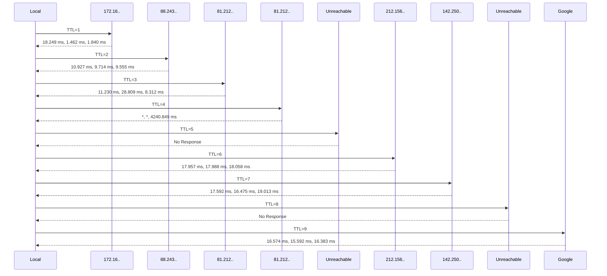

 
Geçenlerde sunucuda bazı ağlara erişim için routing konfigürasyonu yaptık ve hedef adresi nasıl gittiğini kontrol etmek için
meşhur **traceroute** komutunu kullandık. Fakat bu sefer diğerlerinden farklı olarak, daha önce bu komutu kullanıp sonuçları değerlendirmiş olsam da,
gerçekten nasıl çalıştığını öğrenmek istedim. 

Bazı şeylerin nasıl çalıştığını [sihir](https://en.wikipedia.org/wiki/Clarke%27s_three_laws) ya da bizim tabirimizle **şeytan işi** olarak tanımlamak kolayımıza gelebiliyor.

>> Any sufficiently advanced technology is indistinguishable from magic.

Tabi diğer notlarımdan da belki gözlemlediğiniz üzere, biz genelde `There is no magic` yaklaşımı ile sihrin arkasında yatan mantığı ortaya çıkarıp 
anlamaya çalışıyoruz. Bu yazıda genel yaklaşımdan farklı olarak, traceroute nasıl çalıştığını klasik anlamda anlatmaktansa kendim nasıl çalıştığını anlamak için neler
yaptım ne sonuçlara vardım ondan bahsedeceğim.

İlk olarak tabi kullandığım MacOS bilgisayar üzerinde terminal açıp komutu bilinen bir adresle çalıştırmak oldu.
```
 > traceroute www.google.com
traceroute to www.google.com (216.239.38.120), 64 hops max, 52 byte packets
 1  172.16.33.1 (172.16.33.1)  18.249 ms  1.462 ms  1.840 ms
 2  88.243.80.1.dynamic.ttnet.com.tr (88.243.80.1)  10.927 ms  9.714 ms  9.555 ms
 3  81.212.73.201.static.turktelekom.com.tr (81.212.73.201)  11.230 ms  28.809 ms  8.312 ms
 4  * * 34-acibadem-sr14s-t2-2---34-kartal-t3-3.statik.turktelekom.com.tr (81.212.217.1)  4240.849 ms
 5  * * *
 6  307-sof-col-2---34-ebgp-acibadem-sr12e-k.statik.turktelekom.com.tr (212.156.104.158)  17.957 ms  17.988 ms  18.058 ms
 7  142.250.168.28 (142.250.168.28)  17.592 ms  16.475 ms
    142.250.167.192 (142.250.167.192)  19.013 ms
 8  * * *
 9  any-in-2678.1e100.net (216.239.38.120)  16.574 ms  15.592 ms  16.383 ms
```

Yukarıda `www.google.com` adresine traceroute çektiğimizde, gelen her satırı ulaşmak istediğimiz adrese giderken genellikle paketlerimizin yönlendirildiği birer `hop` yani durak ya da birer `router` gibi düşünebilirsiniz.  
Diğer kafa karıştıran oluşturan konu ise birden fazla `ms` yani süre değerleri olabilir. Bunlar bir `hop` için 3 adet sordu atıp üçünün de dönüş sürelerini gösteriyor. 

Bunu yaparken, çok kullandığımız `ping` aracının da kullandığı **ICMP** paketleri gönderiliyor. Traceroute her hop için gönderilen paketin [TTL](https://en.wikipedia.org/wiki/Time_to_live) değeri 1 rakamından başlayarak arttırılıyor. 
Bu şekilde gönderilen ve yolculuğuna başlayan paketin her durakta TTL değeri 1 azaltılıyor, ve bu değer 0 olduğunda ise, ilgili router bize [TTL Exceeded](https://en.wikipedia.org/wiki/Internet_Control_Message_Protocol#Time_exceeded) cevabı geri dönüyor.
Bu cevabı alan, bizim kullandığımız araç olan traceroute ise istemci olarak TTL değerini 1 arttırıp, bir sonra hangi router üzerinden bu paket geçecek, evet ise ne kadar sürecek, değil ise
hangi router üzerinde takılacak bunu anlamaya çalışıyor. Bunu diyagrama dökersek aşağıdaki gibi gözükecektir.



 
Buraya kadar normal, işin teorik kısmını güzel özetledik fakat bunu yaparken , **Wireshark** ile gelen giden paketleri incelediğimde şöyle bir sonuç ortaya çıktı.


Benim beklentim, her satır için TTL değerlerinin 1,2,3 diye arttığını görmekti ama ekran görüntüsünde gözüktüğü gibi hepsinde `Time to Live` kolonunda `,1` yani 1 olarak gözüküyor.

## Traceroute Kodunu İnceleyelim

Yukarıdaki kafama takılan soruyu biraz daha araştırarak, sorarak, okuyarak
bulacağımdan eminim fakat pratik ile yaptığımda çok daha iyi kavradığımı
bildiğim için farklı bir yönden bulmaya karar verdim.  Traceroute dediğimiz şey
sonunda bir kod parçasının derlenmiş hali olan bir araç, aynı routing mantığını
koşan network cihazları, paketimizi gönderen işletim sistemi gibi. En iyi
doküman da kod olduğuna göre neden kodunu indirip, inceleyip, debug edip yani
pratik yaparak anlamıyoruz?

Kullandığım bilgisayar bir MacOS işletim sistemi üzerinde çalıştığından, hemen
**Apple** firmasına başvuruyoruz. MacOS aslında bir Unix türevi işletim sistemi
,Linux ile aynı araçlara genelde sahip olsa da aynı kaynak kodlara sahip
olmak zorunda değil. Genelde MacOS GNU lisans kısıtlamaları sebebiyle **BSD** türevi işletim sistemlerinin araçlarını
kullanıyor. Yani klasik bir Linux işletim sisteminde çalıştırdığınız aynı
**traceroute** GNU kodu iken, MacOS üzerinde bulunan **traceroute** bir BSD
türevi kaynak koda sahip.

Apple bu tarz kullandığı open source araçlar, teknolojiler için [bu adreste](https://opensource.apple.com/releases/) kaynak kodlarının linklerini
yayınlamış. Benim aradığım araç bir network komutu olduğu için `network_cmds`
altında bulunuyor ve [bu adresten](https://github.com/apple-oss-distributions/network_cmds/tree/network_cmds-624.100.5)
kaynak kod paylaşılmış.

## Derleme Sorunları

Kodu indirdikten sonra önce derlemek ile biraz uğraştım diyebilirim, en büyük
sebebi de bir türlü kullanılan bir **SO_RECV_ANYIF** değerin hem kod içinde hem
de sistem kütüphaneleri içinde bulunmamasıydı. Derleme sırasında aşağıdaki hatayı bir türlü geçemedim.

```
> cc -g -I../network_cmds_lib ../network_cmds_lib/network_cmds_lib.c \
traceroute.c as.c ifaddrlist.c version.c findsaddr-socket.c  -o traceroute -lpcap

traceroute.c:826:35: error: use of undeclared identifier 'SO_RECV_ANYIF'
        (void) setsockopt(s, SOL_SOCKET, SO_RECV_ANYIF, (char *)&on,
                                         ^
1 error generated.
```

Tahminim **Xcode** SDK
güncellemesi yaparsam ya da ek bir SDK kurarsam düzeleceği yönündeydi fakat bununla uğraşmak istemeyip
aradığı tanımı `traceroute.h` içinde tanımlayıp aşağıdaki gibi geçtim sonra da
başarılı şekilde derlendi. Bu arada bu değerin nereden geldiğini bilen varsa öğrenmek isterim.

```
#ifndef SO_RECV_ANYIF
#define SO_RECV_ANYIF 0x1104
#endif
```

Başarılı derlendi derlenmesine ama diğer uğraştıran konulardan biri ise bu şekilde derleyip çalıştırdıktan sonra aşağıdaki hataya takıldım bir süre.

```
> cc -g -I../network_cmds_lib ../network_cmds_lib/network_cmds_lib.c \
traceroute.c as.c ifaddrlist.c version.c findsaddr-socket.c  -o traceroute -lpcap
> sudo ./traceroute www.google.com
traceroute: ifaddrlist: SIOCGIFADDR: awdl0: Can't assign requested address
```
Biraz kodu inceledikten sonra içinde bol bol [koşullu derleme](https://en.wikipedia.org/wiki/Conditional_compilation) yönergeleri
olduğunu fark ettim ve sonrasında `HAVE_SYS_SOCKIO_H` ve `HAVE_SOCKADDR_SA_LEN`
derleme parametrelerini göndermediğim zaman başarılı şekilde derlenip çalıştı.

```
cc -g -DHAVE_SYS_SOCKIO_H -DHAVE_SOCKADDR_SA_LEN \
-I../network_cmds_lib ../network_cmds_lib/network_cmds_lib.c \
traceroute.c as.c ifaddrlist.c version.c findsaddr-socket.c  -o traceroute -lpcap
```

Kod beklediğimden daha kompleks çıktı diyebilirim, sanırım diğer Unix türevi işletim sistemlerinde de çalışması
için bol bol koşullu derlemede kullanılan macro parametreleri kullanılmış. Yukarıdaki beni uğraştıran
iki parametre de sanırım MacOS için derlendiğinde kullanılması gerekiyordu, indirdiğim kaynak kod içinde 
CMake, Make gibi bir araç ya da build dokümanı olmadığından bunu biraz deneme yanılma biraz da kodu
inceleyerek buldum diyebilirim.

## Debugging

Artık kodu `debug` sembolleri ile derleyebildik ve sıra geldi adım adım kodu çalıştırıp neler yaptığını anlamaya ve ilk aklımıza takılan neden `TTL` değerinin artmadığını öğrenmeye.
Bu aşamada ben `LLDB` kullanarak kodu debug ettim, ana çalışma akışını öğrendim diyebilirim tabi burada bunu yazmak zor olacağı için, Linux sistemlerde kullandığım `ftrace` benzeri bir araçla
çalışan fonksiyonları çıkarmak istedim, hem ana resim çıkmış olur hem de buraya daha kolay aktarılır. 

Dtrace ile her fonksiyon çağrısını izleyebileceğiniz bir script hazırlayıp ardından onun aracılığı ile programı çağırırsanız size tüm fonksiyon çağrılarını gösteriyor.

```
pid$target:traceroute::entry
{
    printf("%s[%d] %s:%s\n", execname, pid, probemod, probefunc);
}
```

Yukarıdaki kodu `user_functions.d` dosyası olarak kaydedip `dtrace` ile programı çalıştırdığımda aşağıdaki gibi bir çıktı üretiyor.

```
> sudo dtrace -s user_functions.d -c './traceroute www.google.com'
 1  172.16.33.1 (172.16.33.1)  8.701 ms  1.894 ms  2.130 ms
 2  88.243.80.1.dynamic.ttnet.com.tr (88.243.80.1)  8.757 ms  9.586 ms  9.861 ms
 3  81.212.73.201.static.turktelekom.com.tr (81.212.73.201)  8.834 ms  12.060 ms  11.553 ms
cpu     id                    function:name
  1  65465                       main:entry traceroute[35587] traceroute:main
  2  65470                gethostinfo:entry traceroute[35587] traceroute:gethostinfo
  1  65491        clean_non_printable:entry traceroute[35587] traceroute:clean_non_printable
  1  65471                     setsin:entry traceroute[35587] traceroute:setsin
  1  65472               freehostinfo:entry traceroute[35587] traceroute:freehostinfo
  1  65489                 ifaddrlist:entry traceroute[35587] traceroute:ifaddrlist
  1  65490                  findsaddr:entry traceroute[35587] traceroute:findsaddr
  3  65455                   udp_prep:entry traceroute[35587] traceroute:udp_prep
  3  65482               _osswapint16:entry traceroute[35587] traceroute:_osswapint16
  3  65482               _osswapint16:entry traceroute[35587] traceroute:_osswapint16
  3  65482               _osswapint16:entry traceroute[35587] traceroute:_osswapint16
  3  65484                    p_cksum:entry traceroute[35587] traceroute:p_cksum
  3  65482               _osswapint16:entry traceroute[35587] traceroute:_osswapint16
  3  65493                   in_cksum:entry traceroute[35587] traceroute:in_cksum
  3  65493                   in_cksum:entry traceroute[35587] traceroute:in_cksum
  3  65493                   in_cksum:entry traceroute[35587] traceroute:in_cksum
  3  65474                 send_probe:entry traceroute[35587] traceroute:send_probe
  3  65482               _osswapint16:entry traceroute[35587] traceroute:_osswapint16
  3  65475             wait_for_reply:entry traceroute[35587] traceroute:wait_for_reply
  ...
  ...
```

## Dikkat Çeken Detay

Yukarıdaki debug çıktısına baktığınızda belki dikkatinizi çekmemiş olabilir ama ben adım adım debug yaparken o fonksiyona girdiğinde şaşırmıştım.
Fonksiyon çağrılarından birisinin adı `udp_prep` olduğunu görüyorsunuz sonrasında da, `send_probe` ve ardından `wait_for_reply` tekrar edip duruyor.

Koda girip ilgili udp_prep fonksiyonunu aratırsanız ilk karşılaşacağınız yerlerden bir tanesi aşağıda, aslında en büyük ipucu orada açıklanmış.
```
/* List of supported protocols. The first one is the default. The last
   one is the handler for generic protocols not explicitly listed. */
struct	outproto protos[] = {
	{
		.name = "udp",
		.key = "spt dpt len sum",
		.num = IPPROTO_UDP,
		.hdrlen = sizeof(struct udphdr),
		.port = 32768 + 666,
		.prepare = udp_prep,
		.check = udp_check
	},
  ...
  struct	outproto *proto = &protos[0];
```

Yukarıdaki açıklamayı okuyunca aslında bendeki en büyük kafa karışıklığı aydınlanmış oldu. Devam edip kodun içinde diğer fonksiyonların içinde nasıl kullanıldığına bakarsanız bunu görebiliyorsunuz.
`Traceroute` aslında sadece `ICMP` protokolü ile değil, UDP, TCP gibi protokollerle de çalışıyor hatta varsayılan protokol UDP olarak ayarlanmış ve kullandığı port numarası da `32768 + 666` yani `33434`.

## Trafiği Tekrar Gözden Geçirelim

Daha önce yakaladığımız ve TTL sayısının artmadığı trafiği tekrar yukarıdaki bilgi ile kontrol ettiğimizde, aşağıdaki gibi aslında TTL değerlerinin arttığını ve ilk başta beklediğimiz akışa çok benzediğini görebiliyoruz. 


`Time to Live` sütununda artan TTL değerlerini şimdi görebiliyoruz. 

## Kafa Karışıklığının Nedeni Neydi?

Benim asıl kafa karışıklığımın sebebi traceroute nasıl çalışıyor diye araştırdığımda aslında sadece ICMP ile çalıştığı yazıyordu. Aslında durum bu değil, hatta örnek olarak Fortigate [sitesinden](https://www.fortinet.com/resources/cyberglossary/traceroutes) alıntıyı görebilirsiniz.

>> A traceroute works by sending Internet Control Message Protocol (ICMP) packets, and every router involved in transferring the data gets these packets. The ICMP packets provide information about whether the routers used in the transmission are able to effectively transfer the data.
