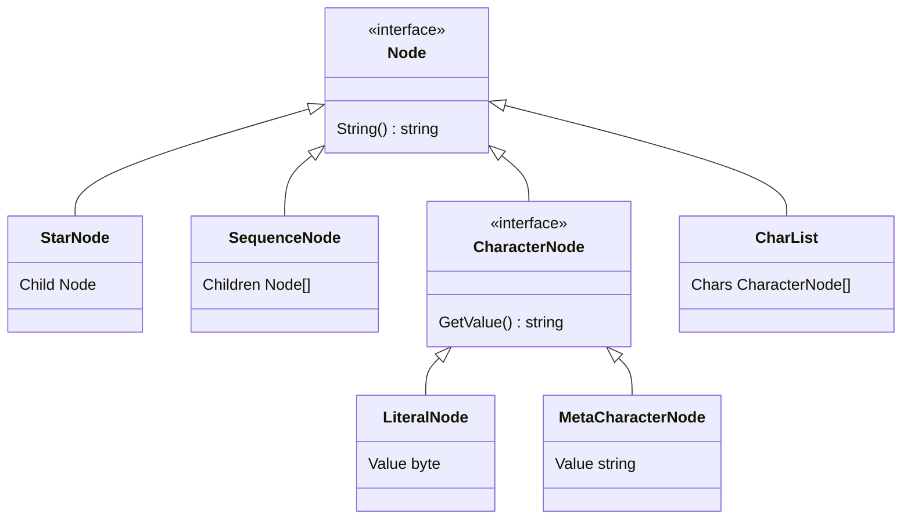

 
Bu yazı serisi şu ana kadar 1 bölümden oluşmaktadır, diğer bölümlere de hazır
oldukça aşağıdaki linklerden ulaşabileceksiniz. Yazı içeriğinde geçen kodlara
[bu linkten](https://github.com/caltuntas/regex-poc) erişebilirsiniz. 

1. [Sıfırdan Regex Motoru - Bölüm 1: Parsing](https://www.cihataltuntas.com/2025/07/25/regex-engine-1) (Bu yazı)
   - Bu yazıda, çok kısa ne yapmak istediğimizden, nasıl yapabileceğimizden ve
     bize verilen regex ifadelerinin parse edilip istediğimiz veri yapısı
     içinde nasıl tutabileceğimizden bahsedeceğiz.
2. [Sıfırdan Regex Motoru - Bölüm 2: Backtracking](https://www.cihataltuntas.com/#) (hazır değil)
3. [Sıfırdan Regex Motoru - Bölüm 3: NFA](https://www.cihataltuntas.com/#) (hazır değil)

## Giriş 

Birkaç ay önce Regex kütüphaneleri ve kullanırken dikkatli olmaz isek başımıza 
gelebilecek sorunlar konusunda bir [yazı serisi](https://www.cihataltuntas.com/2025/04/14/i-hate-regex-1) hazırlamıştım.
Değindiğim konulardan biri ise dikkatli olunmaz ise Javascript, .NET ya da Python gibi daha birçok farklı
programlama dilinde kullandığınız Regex ifadelerinin canlı sistemleri çalışmaz hale getirebileceği idi. 

Hem kendim hem de benim gibi sadece okuduğu, dinlediği, kullandığı bilgi ile yetinmeyip gerçek anlamda kavramak
için el ile tutulur bir şeyler geliştirmeyi sevenlere yeni bir yazı serisi hazırladım.

Bu yazı serisinde, farklı yöntemlerde geliştirilen Regex motorlarının hem hangi algoritmaları kullandığını, 
nasıl geliştirildiğini ve aradaki temel farklarını kendimiz geliştirerek, karşılaştırarak örnekler üzerinden anlamaya çalışacağız.
İleride Regex motorları nasıl çalışıyormuş diye hatırlamak istersem kendime not olarak da burayı kullanmayı planlıyorum.

## Kapsam

Eğer canlı sistemlerde kullanılabilecek bir Regex kütüphanesi geliştireceğiz
desek kendimizi kandırmış oluruz. Dışarıdan bir Regex motorunu kütüphane olarak
kullanırken oldukça basit olduğunu düşünebiliriz fakat **production-ready** bir
Regex kütüphanesi geliştirmek oldukça kapsamlı ve kolay olmayan bir konu. Bu
yüzden kapsamı oldukça daraltıp, daha önceki yazı serisinde canlı ortamda kendi
yaşadığım problemin temelini oluşturan Regex ifadesini kapsayacak kadar bir
Regex motoru geliştirmeyi planlıyorum, en azından bu yazı serisi için. 

Geliştireceğimiz kodun iyileştirebilecek, çok fazla noktası olacağına eminim
burada ana odağımız koddan ziyade farklı Regex motorlarının farklı
yaklaşımlarla nasıl geliştirildiğini uygulayarak öğrenmek.

Eğer hatırlarsanız canlı ortamda aşağıdaki gibi bir regex pattern kullanmıştık ve bu oldukça soruna sebep olmuştu.

```
parent {[\s\S]*type.*[\s\S]*subtype.*[\s\S]*element.*[\s\S]*attributes.*[\s\S]*value testvalue.*[\s\S]*owner person1
```

Bu yüzden burada, geliştireceğimiz mini regex motoru yukarıda kullanılan
yapıları destekleyecek. Günün birinde vaktim olursa eklemeyi planladığım tabi
başka özellikler de var ama kapsamda aşağıdaki maddeler var şuanda.

- [ ] Desteklenmesi gereken Regex ifadeleri
  - [ ] Karakter eşleştirme yeteneği, örnek abc
  - [ ] Özel karakter eşleştirme, örnek .\\s\\S
  - [ ] Karakter kümesi eşleştirme, örnek [abc\\s\\S]
  - [ ] Sıfır ya da daha fazla eşleştirme , kleene star `*`
- [ ] Backtracking algoritması kullanan Regex motoru
- [ ] NFA algoritması kullanan Regex motoru

Anlaşılacağı gibi üzerine istersek daha sonra diğer özellikleri de inşa
edebileceğimiz, ama önceki yazı serisinde problem yaşamamıza sebep olan Regex
ifadelerini destekleyen bir motor ile 2 farklı Regex algoritması yaklaşımını
geliştirerek göreceğiz.

## Teori

Regex, Regular Expressions yani düzenli ifadeler ne demek tarihçesi nereden
geliyor , neden bunlara `düzenli` ifadeler deniyor gibi işin teorik ve
tarihçesini bu yazıda anlatmak yazıyı oldukça sıkıcı yapacaktır, ama işin
teorisini ve geçmişini öğrenmenizi şiddetle tavsiye ederim, diğer şekilde
geliştirme yaparken konu biraz havada kalabilir.

Regex konusunu bir string veri yapıları üzerinde arama, bulma işlemine
özelleşmiş mini bir programlama dili olarak düşünebiliriz. Tam anlamıyla bir
programlama dili kadar kompleks değil, bu yüzden **düzenli ifadeler** içinde
bulunan `düzenli` kelimesi buradan geliyor diyebiliriz.

## Gramer

Eğer **compiler** ya da **parsing** gibi bir konu ile daha önce ilgilendiyseniz, ilk aşamalardan birinin 
dilin destekleyeceği yapının çıkarılması olduğunu deneyimlemişsinizdir.

Aslında Regular Expression programlama dillerine göre `parse` etmesi oldukça
basit olsa da, ben yine de gramerin çıkarılmasının önemli olduğunu düşünüyorum.
Bu çıkardığınız gramer eğer parsing işlemini Bison, Flex, ANTLR gibi bir araç
ile yapacaksanız işinizi oldukça kolaylaştıracak, çünkü bu araçlara grameri
verdikten sonra size `parser` kodunu otomatik olarak oluşturabiliyor.  Yani
parser ya da lexer yazmak zorunda kalmıyorsunuz. 

Bunları dedikten sonra yukarıda neleri destekleyeceğimizi yazmıştık ona göre
oluşturduğum [BNF](https://en.wikipedia.org/wiki/Backus%E2%80%93Naur_form)
formatında grameri aşağıda görebilirsiniz.

```
<expression>     ::= <term> | <term> <expression>
<term>          ::= <factor> <quantifier>?
<factor>        ::= <char> | "." | <escaped_char> | "[" <char_class> "]"
<char_class>    ::= <char_class_item>+
<char_class_item> ::= <char> | <escaped_char> | "."
<char>          ::= [a-z]
<escaped_char>  ::= "\\s" | "\\S"
<quantifier>    ::= "*"
```

Grameri test etmek için [bu linki](https://bnfplayground.pauliankline.com/?bnf=%3Cexpression%3E%20%20%20%20%20%3A%3A%3D%20%3Cterm%3E%20%7C%20%3Cterm%3E%20%3Cexpression%3E%0A%3Cterm%3E%20%20%20%20%20%20%20%20%20%20%3A%3A%3D%20%3Cfactor%3E%20%3Cquantifier%3E%3F%0A%3Cfactor%3E%20%20%20%20%20%20%20%20%3A%3A%3D%20%3Cchar%3E%20%7C%20%22.%22%20%7C%20%3Cescaped_char%3E%20%7C%20%22%5B%22%20%3Cchar_class%3E%20%22%5D%22%0A%3Cchar_class%3E%20%20%20%20%3A%3A%3D%20%3Cchar_class_item%3E%2B%0A%3Cchar_class_item%3E%20%3A%3A%3D%20%3Cchar%3E%20%7C%20%3Cescaped_char%3E%20%7C%20%22.%22%0A%3Cchar%3E%20%20%20%20%20%20%20%20%20%20%3A%3A%3D%20%5Ba-z%5D%0A%3Cescaped_char%3E%20%20%3A%3A%3D%20%22%5C%5Cs%22%20%7C%20%22%5C%5CS%22%0A%3Cquantifier%3E%20%20%20%20%3A%3A%3D%20%22*%22%0A&name=Date%20Format) kullanabilirsiniz

## Lexer

Yukarıdaki açıklamayı yaptıktan sonra tabi işin kolayına kaçıp parser ve lexer
kodunu otomatik oluşturacağımızı düşünenler olabilir ama bir biraz daha
uğraştırıcı olanı seçip bunları kendimiz geliştireceğiz. Eğer kendimiz
geliştireceksek elimizde gramer dosyası olmasa da bu yapılabilir, fakat
elimizde gramerin formal olarak tanımı onu test etmek için ya da ileride farklı
araçlar kullanmak için her zaman faydalı olacaktır.

>> Regex ifadelerini parse etmek için benim izlediğim yaklaşım gibi Lexer ve Parser yazmadan daha
> basit bir yöntemle [Shunting yard algorithm](https://en.wikipedia.org/wiki/Shunting_yard_algorithm) algoritması
> kullanılarak bileşenlerine ayrıştırılabilir, burada daha fazla kod yazacak olsam da benim önceki tecrübemden dolayı bu algoritmayı kullanmayıp Lexer ve Parser yazma işine girişiyorum.


Programlama dili olarak önce `C` ile yapmayı düşünmüştüm ama sonra bellek
yönetimi, işimizi kolaylaştıracak bazı veri yapılarının ve fonksiyonların
eksikliğinden dolayı vazgeçtim ve bu konularda oldukça zengin bir standart
kütüphaneye sahip olduğunu düşündüğüm,ve yine C gibi basit bir dil olan `Go`
ile yapmaya karar verdim.

Her zaman ilk testi yazarak geliştirme yapmasam da, bu tarz çekirdek fonksiyonların önemli olduğunu düşündüğüm projelerde
test ile başlamayı tercih ediyorum, ileride değişiklik olduğunda işimi oldukça kolaylaştırıyor, ayrıca kafamda ne yapmam
gerektiğini de toparlamama yardımcı oluyor diyebilirim.

Aşağıdaki gibi Lexer için testimizi yazalım.

```
package main

import "testing"

func TestNextToken(t *testing.T) {
	l := New("pa.*tpa[ab]cpa\\s")
	tests := []struct {
		expectedType TokenType
		expectedLiteral string
	} {
		{LITERAL, "p"},
		{LITERAL, "a"},
		{DOT, "."},
		{STAR, "*"},
		{LITERAL, "t"},
		{LITERAL, "p"},
		{LITERAL, "a"},
		{LBRACKET, "["},
		{LITERAL, "a"},
		{LITERAL, "b"},
		{RBRACKET, "]"},
		{LITERAL, "c"},
		{LITERAL, "p"},
		{LITERAL, "a"},
		{ESCAPE, "\\"},
		{LITERAL, "s"},
	}

	for i, test := range tests {
		token := l.NextToken()
		if token.Type != test.expectedType {
			t.Fatalf("test[%d], expected type doesn't match. expected = %q, got = %q",i, token.Type, test.expectedType)
		}
		if token.Value != test.expectedLiteral {
			t.Fatalf("test[%d], expected type doesn't match. expected = %q, got = %q",i, token.Value, test.expectedLiteral)
		}
	}
}
```

Testi biraz incelerseniz yapmaya çalıştığımız şeyin elimizde olan bir `string` değişkenin, her `NextToken` metodu ile 
ifadelerine ayrıştırılmasını yapıyoruz.

```
pa.*tpa[ab]cpa\\s
```

Yukarıdaki gibi bir regex ifadesini, bileşenlerine ayırıp bize verecek ve testi geçecek kodu aşağıdaki gibi yazabiliriz.

```
package main

type TokenType string

type Token struct {
	Type  TokenType
	Value string
}

const (
	STAR     = "*"
	DOT      = "."
	LBRACKET = "["
	RBRACKET = "]"
	ESCAPE   = "\\"
	EOF      = "EOF"
)

type Lexer struct {
	input        string
	position     int
	readPosition int
	ch           byte
}

func New(pattern string) *Lexer {
	l := &Lexer{input: pattern}
	return l
}

func (l *Lexer) PeekChar() byte {
	if l.readPosition >= len(l.input) {
		return 0
	}
	return l.input[l.readPosition]
}

func (l *Lexer) NextToken() Token {
	var token Token
	l.readChar()
	if l.ch == 0 {
		token.Type = EOF
		token.Value = ""
	} else if l.ch == '.' {
		token.Type = DOT
		token.Value = string(l.ch)
	} else if l.ch == '*' {
		token.Type = STAR
		token.Value = string(l.ch)
	} else if l.ch == '[' {
		token.Type = LBRACKET
		token.Value = string(l.ch)
	} else if l.ch == ']' {
		token.Type = RBRACKET
		token.Value = string(l.ch)
	} else if l.ch == '\\' {
		token.Type = ESCAPE
		token.Value = string(l.ch)
	} else {
		token.Type = LITERAL
		token.Value = string(l.ch)
	}
	return token
}

func (l *Lexer) readChar() {
	if l.readPosition >= len(l.input) {
		l.ch = 0
	} else {
		l.ch = l.input[l.readPosition]
	}
	l.position = l.readPosition
	l.readPosition++
}
```

Lexer kodu görüldüğü gibi her çağrıldığında bileşenlerine ayırmaktan farklı bir şey yapmıyor, ama işimizi kolaylaştırıyor diyebiliriz.
Şimdi bu bileşenleri kullanarak [Abstract Syntax Tree](https://en.wikipedia.org/wiki/Abstract_syntax_tree) oluşturacak ve aslında
bundan sonra yapacaklarımızın temelini oluşturacak kısmı yazacağız.

## Parser

[Parsing](https://en.wikipedia.org/wiki/Parsing) konusu oldukça geniş bir konu,
genel olarak çözülmüş bir bilgisayar bilimleri problemi olarak düşünülebilir.
Programlama dillerinin çıkışından beri üzerinde çalışılmış, optimize edilmiş ve
çeşitli gramer yapılarına göre farklı algoritmaların öne çıktığı bir alan diyebiliriz.

Biz yaptığımız geliştirmede [Top Down Parsing](https://en.wikipedia.org/wiki/Top-down_parsing) yöntemi içinde
[Recursive descent parser](https://en.wikipedia.org/wiki/Recursive_descent_parser) kullanarak problemi çözmeye çalışacağız.

### Abstract Syntax Tree

Parsing kodunu yazmaya başlamadan önce, ayrıştırdığımız token değerlerini Tree veri yapısında çevireceğiz, bunun için
ne tarz bir veri yapısı içinde tutacağımızı belirlememiz gerekiyor, ardından parsing kodu bize bu veri yapısında bir değişken dönecek.

Benim problem için tutmayı planladığım veri yapısı aşağıdaki gibi.



Kısaca yukarıdaki tiplerin hangi amaç için kullanılacağını da açıklayalım, kodu incelerseniz zaten görülecek ama yine de burada dursun.

- *Node* : Tüm veri yapılarının temelini oluşturuyor, soyutlama için kullanacağız.
- *SequenceNode* : `abc` gibi bir regex ifadesinde, sırayla bütün bileşenleri içeren veri tipi, özetle önce `a` sonra `b` sonra `c` içermesini söyleyen veri yapısı
- *StarNode* : `pa.*` ifadesinde bulunan `*` için kullanılan veri yapısı
- *CharacterNode* : Meta ya da Literal karakter olarak tutulan tipler için oluşturduğum üst interface
- *LiteralNode* : `a` karakterini gerçek değeri ile eşleştirmesini söyleyen veri yapısı
- *MetaCharacterNode* : `.` ya da `\s` gerçek anlamı dışında eşleşme yapmasını bildiren veri yapısı
- *CharList* : `[abc]` gibi regex ifadelerini temsil eden veri yapısı

Yukarıdaki gibi düşündüğümüz veri yapılarını tasarladığımız kod aşağıdaki gibi olacak.

```
package main

import "fmt"

type Node interface {
	String() string
}

type StarNode struct {
	Child Node
}

type SequenceNode struct {
	Children []Node;
}

func (n *SequenceNode) String() string {
	str := ""
	str += fmt.Sprintln("SequenceNode, Children")
	for i,child := range n.Children {
		str += fmt.Sprintf("Child %d = %s\n", i, child.String())
	}
	return str
}

type CharacterNode interface {
	GetValue() string
	String() string
}

type LiteralNode struct {
	Value byte
}

func (n* LiteralNode) String() string {
	return string(n.Value)
}

func (n* LiteralNode) GetValue() string {
	return n.String()
}

type MetaCharacterNode struct {
	Value string
}

func (n* MetaCharacterNode) String() string {
	return n.Value
}

func (n* MetaCharacterNode) GetValue() string {
	return n.String()
}

func (n *StarNode) String() string {
	return n.Child.String() + "*"
}

type CharList struct {
	Chars []CharacterNode
}

func (n *CharList) String() string {
	str := "["
	for _,cn := range n.Chars {
		str += cn.String()
	}
	return str + "]"
}
//..
//..

```

Gerekli veri yapılarını oluşturduktan sonra işin en önemli kısmına yani parsing kodunu yazmaya sıra geldi.
Parsing kodu bize verilen Regular Expression ifadesini bileşenlerine ayırıp `Node` tipinde bir veri yapısı dönecek.
Önce basit bir pattern ile nasıl gözükmesi gerektiğini açıklayalım sonra koda geçelim.

Mesela `pa.*b` gibi bir pattern aşağıdaki gibi bir AST veri yapısına dönüşmesi gerekiyor.

```
Sequence:
    Literal: 'p'
    Literal: 'a'
    Star:
      Meta: '.'
    Literal: 'b'
```

Yine test yazarak başlamak işimizi daha kolaylaştıracaktır, farklı bir çok senaryoya göre üretmesi gereken, veri yapılarını
test ettiğimiz aşağıdaki gibi bir test kodu yazabiliriz.

```
//...
//...
var b NodeBuilder

func TestRegexParser(t *testing.T) {
	cases := map[string]Node{
		"p[ab]*c": b.Seq(
			b.Lit('p'),
			b.Star(b.List(b.Lit('a'), b.Lit('b'))),
			b.Lit('c'),
		),
		"p[\\sb]c": b.Seq(
			b.Lit('p'),
			b.List(b.Meta(WHITESPACE), b.Lit('b')),
			b.Lit('c'),
		),
		"pa\\s": b.Seq(
			b.Lit('p'),
			b.Lit('a'),
			b.Meta(WHITESPACE),
		),
		"pa[ab]c": b.Seq(
			b.Lit('p'),
			b.Lit('a'),
			b.List(b.Lit('a'), b.Lit('b')),
			b.Lit('c'),
		),
		"pa.*t": b.Seq(
			b.Lit('p'),
			b.Lit('a'),
			b.Star(b.Meta(DOT)),
			b.Lit('t'),
		),
		"pa {": b.Seq(
			b.Lit('p'),
			b.Lit('a'),
			b.Lit(' '),
			b.Lit('{'),
		),
	}
	for key, val := range cases {
		l := New(key)
		parser := NewParser(l)
		node := parser.Ast()
		ok := testNode(t, node.(*SequenceNode), val)
		if !ok {
			t.Fatalf("expected SequenceNode, got %T", node)
		}
	}
}
```

Bundan sonra son aşamada aşağıdaki gibi parser kodunu yazabiliriz. 

```
package main

type Parser struct {
	l            *Lexer
	currentToken Token
	nextToken    Token
}

func NewParser(l *Lexer) *Parser {
	p := &Parser{l: l}
	p.readNextToken()
	p.readNextToken()
	return p
}

func (p *Parser) Ast() Node {
	return p.parseExpression()
}

func (p *Parser) parseExpression() Node {
	var node Node
	sequence := &SequenceNode{}
	node = sequence
	for p.currentToken.Type != EOF {
		term := p.parseTerm()
		if term != nil {
			sequence.Children = append(sequence.Children, term)
		}
	}
	return node
}

func (p *Parser) parseTerm() Node {
	factor := p.parseFactor()
	if p.nextToken.Type == STAR {
		star := &StarNode{}
		star.Child = factor
		p.readNextToken()
		p.readNextToken()
		return star
	}
	p.readNextToken()
	return factor
}

func (p *Parser) parseFactor() Node {
	var node Node
	switch p.currentToken.Type {
	case DOT:
		node = &MetaCharacterNode{Value: "."}
	case LITERAL:
		node = &LiteralNode{Value: p.currentToken.Value[0]}
	case ESCAPE:
		p.readNextToken()
		if p.currentToken.Value == "s" {
			return &MetaCharacterNode{Value: WHITESPACE}
		}
		if p.currentToken.Value == "S" {
			return &MetaCharacterNode{Value: NONWHITESPACE}
		}
	case LBRACKET:
		p.readNextToken()
		charList := &CharList{}
		for p.currentToken.Type != RBRACKET {
			char := p.parseFactor()
			charList.Chars = append(charList.Chars, char.(CharacterNode))
			p.readNextToken()
		}
		return charList
	}
	return node
}

func (p *Parser) readNextToken() {
	p.currentToken = p.nextToken
	p.nextToken = p.l.NextToken()
}
```


Anlaşılması zor bir kod olduğunu düşünmüyorum, `resursive` olarak beklediğimiz ağaç veri yapısını oluşturup bize 
veriyor, bir sonraki aşamada bu veri yapısını kullanarak bir çok Regex motorunun yaptığı gibi `Backtracking` yaklaşımı ile
eşleştirme yapacağız. 
