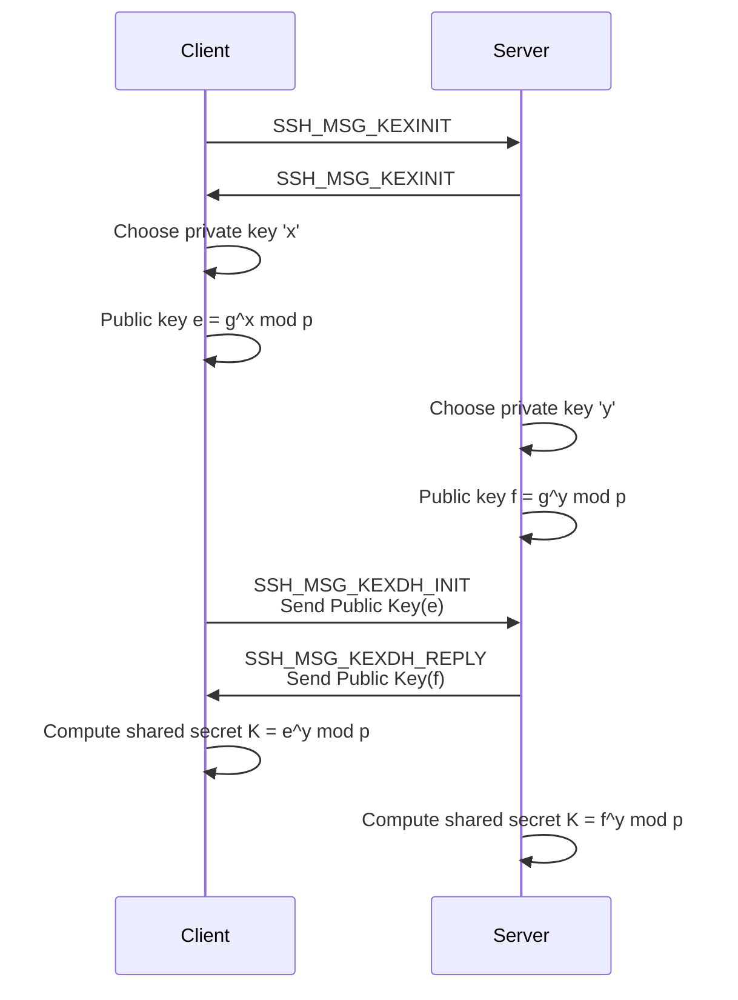

 

Bu yazı serisi şu ana kadar 3 bölümden oluşmaktadır, diğer bölümlere aşağıdaki linklerden ulaşılabilir. Yazı içeriğinde geçen kodlara
[bu linkten](https://github.com/caltuntas/ssh-decryption) ulaşabilirsiniz.

1. [SSH Trafiğini Çözümleyelim 1 - Patch](https://www.cihataltuntas.com/2025/02/04/decrypt-ssh-traffic-1)
   - Bu yazıda, genel olarak SSH protokolünün yapısı ve şifreleme için
     kullanılan anahtar değişim algoritmalarının nasıl çalıştığı inceliyoruz.
     Ardından var olan bir SSH kütüphanesinin kodu değiştirilerek ele geçirilen
     şifreleme anahtarlarını kendi yazdığımız kod ile kaydedilmiş bir trafiği
     çözümlemek için kullanıyoruz.
2. [SSH Trafiğini Çözümleyelim 2 - Wireshark](https://www.cihataltuntas.com/2025/04/10/decrypt-ssh-traffic-2) 
   - Bu yazıda, Wireshark kullanarak trafiği çözümlemek istediğimizde
     karşılaştığımız sorunu hata ayıklaması yaparak tespit ediyoruz, sonrasında
     da Wireshark kodunu düzelterek, trafiği Wireshark üzerinde de
     çözümlüyoruz.
3. [SSH Trafiğini Çözümleyelim 3 - Private Key](https://www.cihataltuntas.com/2025/11/22/decrypt-ssh-traffic-3) (Bu yazı)
   - Bu yazıda, Private Key nedir, eğer ele geçirebilirsek trafiği başka
     herhangi bir değer kullanmadan çözümleyebilir miyiz diye inceleme yapıyoruz.

SSH trafiğini çözümleme yolculuğumuzda, bir önceki yazımızda ilk yazıda deneyip başarısız olduğumuz `Wireshark` ile trafiği çözümleme işleminin Wireshark kodunda bulunan bir hata 
sebebiyle oluştuğunu tespit edip ardından düzeltip, kaydettiğimiz SSH trafiğini Wireshark üzerinde çözümlemeyi başarmıştık. Bunu yaparken SSH kodunun içinde yaptığımız değişiklik ile 
`Shared Key` değerini yazdırıp bu değeri de Wireshark üzerinde ayarlayarak sağlamıştık.

Bu sefer hep duyduğumuz fakat benim açımdan deneme fırsatımın olmadığı bir konu üzerine gidelim. Hani güvenlik konularında `Private Key` kavramı hep konuşulur ve 
bu değer olmadan trafiği ya da şifrelenmiş bilgileri çözümlemenin neredeyse imkansız olduğundan bahsedilir, bu yazıda daha önceki konularda incelediğimiz 
SSH trafiğini o bahsedilen meşhur `Private Key` anahtarını kullanarak çözümlemeye çalışacağız. Bunu yaparken SSH protokolünü, özel anahtarın nasıl üretildiğini, ve gerçekten özel
anahtarı ele geçiren birisinin trafiği nasıl çözümleyebileceğini anlayacak örnek kod ile pekiştireceğiz, başlayalım.

## Hatırlayalım

İlk yazıyı hatırlayacak olursanız, trafiği çözümlemeyi koda uyguladığımız bir `patch` ile encryption ve decryption aşamalarında kullanılan tüm bilgileri 
içeren `config` objesinin içeriğini alarak yapmıştık. Bu nesne içinde hem gelen `inbound` hem de giden `outbound` trafik için kullanılan tüm şifreleme 
anahtarlarını, tiplerini ve özelliklerini aşağıdaki gibi içerdiği için trafiği kod ile çözmek bunları düzgün şekilde kullanmak kadar kolaydı. 
```
{
  "inbound": {
    "seqno": 3,
    "decipherInfo": {
      "sslName": "aes-128-ctr",
      "blockLen": 16,
      "keyLen": 16,
      "ivLen": 16,
      "authLen": 0,
      "discardLen": 0,
      "stream": true
    },
    "decipherIV": {
      "type": "Buffer",
      "data": [ 42, 89, 189, 83, 230, 140, 64, 64, 215, 11, 40, 159, 8, 122, 39, 0 ]
    },
    "decipherKey": {
      "type": "Buffer",
      "data": [ 102, 79, 234, 204, 184, 103, 135, 48, 72, 170, 49, 72, 101, 246, 79, 140 ]
    },
    "macInfo": {
      "sslName": "sha256",
      "len": 32,
      "actualLen": 32,
      "isETM": false
    },
    "macKey": {
      "type": "Buffer",
      "data": [ 172, 195, 86, 179, 48, 9, 240, 252, 8, 51, 81, 213, 27, 199, 239, 2, 218, 160, 169, 129, 213, 139, 247, 86, 59, 217, 220, 141, 18, 207, 121, 62 ]
    }
  },
  ...
  ...
```

Peki yukarıda gördüğümüz bu değerler nasıl oluşturuluyor? Bu değerler ilk
yazıda bahsettiğimiz Diffie-Hellman algoritmasının bir parçası olarak sunucu ve
istemcinin seçip kimse ile paylaşmadığı `Private Key` yani özel anahtar değerini kullanarak
hesaplanıyor. Hazırladığımız patch içeriğinde aslında özel anahtarı da ekrana yazdırmıştık ama kolaya kaçıp
direk hazırlanmış olan yukarıdaki şifreleme anahtarlarını kullanarak trafiği çözümlemiştik. Çıktı aşağıdaki gibiydi.

```
Private Key :  302e020100300506032b656e04220420a852b2ec81f6f095bd1aa504a5af1d2dc40e52c459f53da38be47ef08682a86d
Handshake: (local) computeSecret: 00bcc3375a02c54aa7e33de84687dac73586419d8d7a230dfd32e7b803da5dcf47
Verifying signature ...
Verified signature
SECRET: 0000002100bcc3375a02c54aa7e33de84687dac73586419d8d7a230dfd32e7b803da5dcf47
------config------
{
  "inbound": {
  ...
  ...
```

Kısacası config içinde bulunan önce `SECRET` olarak yukarıda gördüğümüz paylaşılan anahtar, ve bu paylaşılan anahtar ile hesaplanan tüm diğer şifreleme 
anahtarları üst satırda görülen `Private Key` değeri ile ortaya çıkıyor. Biz de aynı şeyi yapıp eğer özel anahtar değerini ele geçirebilirsek trafiği çözümleme işlemini 
nasıl yaparız onu inceleyeceğiz. 

Bu arada kodda kritik bir güvenlik açığı bulunmadığı sürece normal şartlarda özel anahtar değerini ele geçirmek imkansıza yakın diyebiliriz,
bu yüzden biz yine ilk kullandığımız patch yöntemi ile ekrana yazdırdığımız özel anahtar değerini kullanarak bu işlemleri gerçekleştireceğiz. 

## Özel Anahtarın Yeri

İlk yazımızda **Sihirli Kelimemiz: Diffie–Hellman** başlığı altında başlığı altında kalem kağıt ile basit olarak özel anahtarın nerede ve nasıl kullanıldığından bahsetmiştim.
SSH protokolü özelinde daha fazla detaylara [bu RFC dokümanı](https://datatracker.ietf.org/doc/html/rfc4419) üzerinden ulaşabilirsiniz. Hatırlamak için aşağıya bu sefer SSH 
protokolünde kullanılan isimleri ile koyalım ama basit hesaplanması için ilk yazıdaki bölüme bakmanızı tavsiye ederim.

```
e = g^x mod p
f = g^y mod p
K = e^y mod p
K = f^x mod p
```

Yukarıda `x` ve `y` istemci ve sunucunun kendi seçip kimse ile paylaşmadığı özel anahtarları temsil ediyor. `K` ise
ulaşmak istediğimiz ortak şifreleme anahtarımız. Özet olarak hem sunucu, hem istemcinin amacı paylaşılmayan özel anahtarları `x ve y` ve paylaşılan `e` ve `f` gibi genel anahtarları ve
`p` , `g` gibi her iki tarafında bildiği değerleri kullanarak ortak anahtar `K` değerine ulaşmak.

## SSH ve Anahtar Değişimi

Yukarıdaki açıklamadan anlaşıldığı gibi, sunucu ve istemcinin `e` ve `f` gibi birbirlerinin genel anahtarlarını ve `p` ve `g` gibi formülde bulunan bazı değerleri
her iki tarafından da bilmesi gerekiyor ki aynı ortak anahtara ulaşabilsinler, ilgili RFC dokümanında detaylı belirtilse de ben kendi anlayışıma yardım 
etsin diye bunu bir akış diyagramına çevirmeyi daha kolay buluyorum. Karşılıklı bu bilgiler nasıl paylaşılıyor ve süreç nasıl işliyor görelim.



Peki bu dediklerimiz gerçek bir SSH trafiği üzerinde nasıl gözüküyor ona bakalım, nede olsa amacımız böyle bir trafiği
alıp elimizdeki `Privaye Key` değerlerinden biri ile çözümlemek.


## Ortak Anahtarın Hesaplanması

Elimizde özel anahtar var diyelim, yukarıdaki formüle bakarak aslında ortak anahtar `K` değerini kolaylıkla hesaplayabiliriz.
Bunu kod ile yapacağımızı düşürsek de, aşağıdakine benzer bir kod, ortak anahtarı bize verecektir.

```javascript
const privKey = "somerandomvalue";
const clientPrivateKey = Buffer.from(privKey, "hex"); 

const dh = crypto.createDiffieHellmanGroup('modp2');
const dhKey = crypto.createDiffieHellman(dh.getPrime(),dh.getGenerator());
dhKey.setPublicKey(clientDhPubKey);
dhKey.setPrivateKey(clientPrivateKey);
let secret = dhKey.computeSecret(serverDhGexReply.f);
```

Pcap formatında kaydettiğimiz trafiği tekrar okuyup genel anahtar `f,e` değerlerini ekranda gördüğümüz gibi açık olarak okuyabiliyoruz, elimizde ekrana yazdırarak bulduğumuz
özel anahtar `privKey` de var. Bunları kullanarak ortak anahtar `K` yani `secret` değerini yukarıdaki gibi hesaplayabiliriz.

Peki elimizde hesapladığımız ortak anahtar değeri ile bütün trafiği çözebilecek miyiz? Maalesef hayır, günün sonunda yukarıda `config` nesnesi içinde bulunan
neredeyse tüm değerlere önce ulaşmamız gerekecek. Ancak ardından trafiği çözebilecek hale geleceğiz. Bunun sadece ilk adımı ortak anahtar `shared secret`
değerinin hesaplanması. Bundan sonrası için SSH protokol dokümanından [Output from Key Exchange](https://datatracker.ietf.org/doc/html/rfc4253#section-7.2) kısmına bakarak
başlayabiliriz.

>> The key exchange produces two values: a shared secret K, and an exchange hash H.  Encryption and authentication keys are derived from these.

Dokümandan anlaşıldığı gibi, biz `K` değerini elde etmek sadece ilk adım sonrasında `H` yani **hash** değerini en sonunda da gerçek anlamda paketleri
çözümleyebilecek şifreleme anahtarlarını elde edeceğiz.

## Hash Değerinin Hesaplanması

Yine RFC dokümanında [bu kısmın](https://datatracker.ietf.org/doc/html/rfc4253#section-8) sonunda **hash** değerinin nasıl hesaplandığı belirtilmiş.

```
The hash H is computed as the HASH hash of the concatenation of the following:

  string    V_C, the client's identification string (CR and LF excluded)
  string    V_S, the server's identification string (CR and LF excluded)
  string    I_C, the payload of the client's SSH_MSG_KEXINIT
  string    I_S, the payload of the server's SSH_MSG_KEXINIT
  string    K_S, the host key
  mpint     e, exchange value sent by the client
  mpint     f, exchange value sent by the server
  mpint     K, the shared secret
```

Yukarıdaki açıklamaya bakarak, şöyle bir kod yazdım, detaylarına birazdan değineceğim.

```
function concat(...strings){
  const buffers =[];
  strings.forEach(str => {
    const lenBuffer = Buffer.allocUnsafe(4);
    lenBuffer.writeUInt32BE(str.length,0);
    buffers.push(lenBuffer);
    buffers.push(Buffer.from(str));
  });
  return Buffer.concat(buffers);
}

const hash = crypto.createHash("sha1");
sessionId = hash.update(concat(
  clientIdentification,
  serverIdentification,
  clientKexInitPayload,
  serverKexInitPayload,
  serverDhGexReply.host_key,
  clientDhPubKey,
  serverDhGexReply.f,
  secret
)).digest();
```

Hash hesaplamasında kullanılan ortak anahtar `K` haricindeki bütün değerler zaten açık olarak gönderildiği için değerlerini paketleri parse ederken zaten alabiliyoruz. 
Bu değerleri SSH dokümanında dediği gibi `concat` işlemine tabi tutuyoruz, fakat tutarken de, SSH protokolünde bir tipi karşı tarafa iletirken ya da kullanırken her zaman `length`
değerini de önüne eklemeniz gerektiğinden `lenBuffer` ile bu işlemi yapıp sonuna değerin kendisini ekliyoruz. 

Yukarıda kod içinde kullandığımız değerlerin Wireshark üzerinde nasıl gözüküyor bakalım, kod ile bu değerleri nasıl okuduğuma ayrıca değineceğim.


## Şifreleme Anahtarlarının Hesaplanması

Yine daha önce referans verdiğimiz [Output from Key Exchange](https://datatracker.ietf.org/doc/html/rfc4253#section-7.2) kısmının en sonunda
diğer şifreleme anahtarlarının da nasıl elde edileceği yazılmış.

```
   Encryption keys MUST be computed as HASH, of a known value and K, as follows:
   
   o  Initial IV client to server: HASH(K || H || "A" || session_id)
      (Here K is encoded as mpint and "A" as byte and session_id as raw
      data.  "A" means the single character A, ASCII 65).
   o  Initial IV server to client: HASH(K || H || "B" || session_id)
   o  Encryption key client to server: HASH(K || H || "C" || session_id)
   o  Encryption key server to client: HASH(K || H || "D" || session_id)
   o  Integrity key client to server: HASH(K || H || "E" || session_id)
   o  Integrity key server to client: HASH(K || H || "F" || session_id)
```

Evet son aşamaya gelmiş sayılırız, paketleri okuyabilmek için hesaplamamız gereken şifreleme anahtarlarının hepsi yukarıda belirtilmiş.
Elimizde `K` yani özel anahtar var, anahtar değişimi sırasında açık olarak gönderilen bilgilerle hesapladığımız hash yani `H` değerimiz de var,
geriye kalan her anahtarı yukarıda belirtildiği gibi hesaplamak. Bunu koda dökmeden şu kısmı da not olarak aynı referanstan buraya ekleyeyim.


>> The exchange hash H from the first key exchange is additionally used as the session identifier

```javascript

function deriveKey(K, H, sessionId, char, hashAlgo) {
  const hash = crypto.createHash(hashAlgo);
  hash.update(K);
  hash.update(H);
  hash.update(char);
  hash.update(sessionId);
  return hash.digest();
}

const K = Buffer.allocUnsafe(4 + secret.length);
K.writeUInt32BE(secret.length, 0);
K.set(secret, 4);
ivCS = deriveKey(K, sessionId, sessionId, "A", "sha1");
ivCS = ivCS.subarray(0, 16);
ivSC = deriveKey(K, sessionId, sessionId, "B", "sha1");
ivSC = ivSC.subarray(0, 16);
keyCS = deriveKey(K, sessionId, sessionId, "C", "sha1");
keyCS = keyCS.subarray(0, 16);
keySC = deriveKey(K, sessionId, sessionId, "D", "sha1");
keySC = keySC.subarray(0, 16);
decipherCS = crypto.createDecipheriv("aes-128-ctr", keyCS, ivCS);
decipherSC = crypto.createDecipheriv("aes-128-ctr", keySC, ivSC);
```

Yukarıdaki kod parçası ile gerekli olan tüm materyalleri elde ettik, bundan sonra bir SSH trafiğini kaydedip ardından ekrandan aldığımız çıktıyı koda verip test etmek kaldı.

## Test

Testimizi yaparken şunu da belirtmem lazım, SSH hem anahtar değişim, hem şifreleme hem de mesaj doğrulama konusunda çok fazla farklı algoritma ile çalışabiliyor. 
Ben yaptığım testlerde kullanılan algoritmaları özellikle sınırlı tuttum. Aksi durumda sunucu ve istemci farklı algoritmalar seçebilir ve kodunda o ilgili algoritmada 
kullanılan `cipher,hash..` yapılarını kullanması gerekir. Benim bütün bu makale serisi boyunca kullandığım algoritmalar aşağıda görülebilir.

```
const algorithms = {
	kex: [
	  'diffie-hellman-group1-sha1',
	],
	cipher: [
	  'aes128-ctr',
	],
	hmac: [
	  'hmac-sha2-256',
	],
};
```

Yazdığımız kodu test etmek için basit bir SSH trafiği oluşturan `ssh-ls.js` kodunu çalıştırıp trafiği kaydetmeye başlıyoruz, ardından 
`Private Key` değerini alan ve onu `ssh-reconstruct-keys.js` koduna parametre olarak gönderen bir docker imajı hazırladım, bu şekilde paket kaydetme, çözme gibi işlemlerin hepsini kolayca otomatik hale getirdik.

```
> docker build -t sshdecrypt .
> docker run --rm -e TARGET_USERNAME=testuser -e TARGET_PASSWORD="testpassword" -e TARGET_HOST=192.168.1.125  sshdecrypt private
...
...
Private Key :  302e020100300506032b656e04220420a852b2ec81f6f095bd1aa504a5af1d2dc40e52c459f53da38be47ef08682a86d
...
...
Encrypted SSH Packet, CS : d1332a363fa6ccc430517a01a3b2a18533b26a429c4c9220...
MAC, CS : 558114765d2a70d0a7f165f6e5041e3f908f35f25543ea1c35a8f30d57c6cd52
Decrypted Packet : 0000004c0d320000000963616c74756e7461730000000e7373682d63...
packet length=76
message code=USERAUTH_REQUEST
Username : testuser
Password : testpassword
...
...
```

Kodun önemli kısımlarından zaten bahsettim, ama bütün olarak önemli gördüğüm kısmını aşağıya yapıştırdım. Ayrıca en üstte bulunan link aracılığı ile
Github üzerinden tamamına erişebilirsiniz.

```
let ivCS;
let keyCS;
let ivSC;
let keySC;
let decipherCS;
let decipherSC;
let newKeysSent = false;
let packet_number = 0;
let clientAddress;
let clientDhPubKey;
let serverDhGexReply;
let clientKexInitPayload;
let serverKexInitPayload;
let clientIdentification;
let serverIdentification;
let sessionId;
pcapSession.on("packet", (rawPacket) => {
  const packet = pcap.decode.packet(rawPacket);
  if (packet.payload.ethertype !== 2048) return;
  if (packet_number == 0) {
    clientAddress = packet.payload.payload.saddr.toString();
    serverAddress = packet.payload.payload.daddr.toString();
  }
  packet_number++;
  const tcp = packet.payload.payload.payload;
  const direction =
    packet.payload.payload.saddr.toString() === clientAddress ? "CS" : "SC";

  if (tcp && tcp.data && (tcp.sport === 22 || tcp.dport === 22)) {
    const sshData = tcp.data ? tcp.data.toString("utf-8") : "";
    if (sshData.startsWith("SSH-")) {
      console.log("SSH Protocol Version Exchange:");
      console.log(sshData.trim());
      if (direction === "CS") clientIdentification = sshData.trim();
      else if (direction === "SC") serverIdentification = sshData.trim();
    } else if (tcp.data) {
      let packet_len, msg_code;
      if (newKeysSent === false) {
        packet_len = tcp.data.subarray(0, 4).readInt32BE(0);
        padding_len = tcp.data[4];
        msg_code = tcp.data[5];
        const msg_name = Object.keys(MESSAGE).find(
          (key) => MESSAGE[key] === msg_code
        );
        console.log(`message code=${msg_code},${msg_name}`);
        const payload = tcp.data.subarray(5, tcp.data.length - padding_len);
        const payloadWithoutMessageType = tcp.data.subarray(6);
        console.log("direction = " + direction);
        console.log(payload.toString("hex"));
        const parser = packetParser(payloadWithoutMessageType, 0);
        if (msg_code === MESSAGE.KEXINIT) {
          const obj = parser.readObject(SSH_MSG_KEXINIT);
          if (direction === "CS") {
            clientKexInitPayload = Buffer.from(payload);
          } else if (direction === "SC") {
            serverKexInitPayload = Buffer.from(payload);
          }
          console.log(obj);
        } else if (
          msg_code === MESSAGE.KEXDH_GEX_INIT ||
          msg_code === MESSAGE.KEXDH_INIT
        ) {
          const obj = parser.readObject({
            e: "mpint",
          });
          clientDhPubKey = obj.e;
          console.log(obj);
        } else if (
          msg_code === MESSAGE.KEXDH_GEX_REPLY ||
          msg_code === MESSAGE.KEXDH_REPLY
        ) {
          const obj = parser.readObject(KEXDH_REPLY);
          serverDhGexReply = obj;
        }
      } else {
        let decryptedPacket;
        let encryptedPacket = tcp.data.subarray(0, tcp.data.length - 32);
        let mac = tcp.data.subarray(tcp.data.length - 32);
        if (direction === "CS") {
          decryptedPacket = decipherCS.update(encryptedPacket);
        } else if (direction === "SC") {
          decryptedPacket = decipherSC.update(encryptedPacket);
        }
        console.log(`Entire Packet, ${direction} :`, tcp.data.toString("hex"));
        console.log(
          `Encrypted SSH Packet, ${direction} :`,
          encryptedPacket.toString("hex")
        );
        console.log(`MAC, ${direction} :`, mac.toString("hex"));
        packet_len = decryptedPacket.subarray(0, 4).readInt32BE(0);
        padding_len = decryptedPacket[4];
        msg_code = decryptedPacket[5];
        const msg_name = Object.keys(MESSAGE).find(
          (key) => MESSAGE[key] === msg_code
        );
        console.log("Decrypted Packet :", decryptedPacket.toString("hex"));
        console.log(`packet length=${packet_len}`);
        console.log(`message code=${msg_name}`);
        if (msg_code === MESSAGE.USERAUTH_REQUEST) {
          const parser = packetParser(decryptedPacket, 6);
          const obj = parser.readObject(USERAUTH_REQUEST);
          if (obj.method === "password") {
            const passObj = parser.readObject({
              isChange: "boolean",
              password: "string",
            });
            console.log("Username : " + obj.user);
            console.log("Password : " + passObj.password);
          }
        }
      }
      if (msg_code == MESSAGE.NEWKEYS) {
        privKey = process.argv[2];
        const key=privKey.trim();
        console.log("private key passed="+key);
        const clientPrivateKey = Buffer.from(key, "hex");

        const dh = crypto.createDiffieHellmanGroup("modp2");
        const dhKey = crypto.createDiffieHellman(
          dh.getPrime(),
          dh.getGenerator()
        );
        dhKey.setPublicKey(clientDhPubKey);
        dhKey.setPrivateKey(clientPrivateKey);
        let secret = dhKey.computeSecret(serverDhGexReply.f);
        const hash = crypto.createHash("sha1");
        sessionId = hash
          .update(
            concat(
              clientIdentification,
              serverIdentification,
              clientKexInitPayload,
              serverKexInitPayload,
              serverDhGexReply.host_key,
              clientDhPubKey,
              serverDhGexReply.f,
              secret
            )
          )
          .digest();
        console.log("H=" + sessionId.toString("hex"));
        
        const K = Buffer.allocUnsafe(4 + secret.length);
        K.writeUInt32BE(secret.length, 0);
        K.set(secret, 4);
        ivCS = deriveKey(K, sessionId, sessionId, "A", "sha1");
        ivCS = ivCS.subarray(0, 16);
        ivSC = deriveKey(K, sessionId, sessionId, "B", "sha1");
        ivSC = ivSC.subarray(0, 16);
        keyCS = deriveKey(K, sessionId, sessionId, "C", "sha1");
        keyCS = keyCS.subarray(0, 16);
        keySC = deriveKey(K, sessionId, sessionId, "D", "sha1");
        keySC = keySC.subarray(0, 16);
        decipherCS = crypto.createDecipheriv("aes-128-ctr", keyCS, ivCS);
        decipherSC = crypto.createDecipheriv("aes-128-ctr", keySC, ivSC);
        newKeysSent = true;
      }
    }
  }
});

pcapSession.on("error", (err) => {
  console.error("Error:", err.message);
});

pcapSession.on("complete", () => {
  console.log("Finished reading pcap file.");
});

function deriveKey(K, H, sessionId, char, hashAlgo) {
  const hash = crypto.createHash(hashAlgo);
  hash.update(K);
  hash.update(H);
  hash.update(char);
  hash.update(sessionId);
  return hash.digest();
}

function concat(...strings) {
  const buffers = [];
  strings.forEach((str) => {
    const lenBuffer = Buffer.allocUnsafe(4);
    lenBuffer.writeUInt32BE(str.length, 0);
    buffers.push(lenBuffer);
    buffers.push(Buffer.from(str));
  });
  return Buffer.concat(buffers);
}
```

## Ne Öğrendik?

En başta özel anahtarın makinede duran sabit bir değer olmadığını öğrendik. Ayrıca eğer private key ele geçirilirse ya da geçirebilirsek, başından beri kaydettiğiniz SSH trafiğini çözümleyip bütün detaylarını görebilirsiniz. Fakat burada
boş hayallere de kapılmamak lazım, ilk olarak ele geçirsek bile bu kalıcı bir private key değil, her oturum sırasında değişen bir sayı hatta aynı oturum 
sırasında bile belirli bir mesaj sayısına ya da talebe göre SSH protokolü yeni bir `KEX` süreci başlatıp anahtarları yenileyebiliyor.

Diğer bir zorluk, trafiği başından dinlemeyip ortasından dinlemeye başladıysak başka anahtar oluşumu için gerekli olan bilgileri elde edemeyeceğiz ve elimizde özel anahtar dahi olsa trafiği çözemeyeceğiz. 
Yukarıda özel anahtarı oluşturmak için diğer gerekli bilgileri görmüştük hatırlarsanız onların hepsi, KEX sürecinin başında değiş tokuş yapılıyor.

Son olarak ilk yazıda kaçak güreşip bütün gerekli şifreleme anahtarlarını yazdırarak trafiği çözmüştük, bu yazıda biraz ilerleme kaydedip, biraz daha zor yoldan elimizde sadece özel anahtar olması durumunda
trafiği çözmeyi denedik ve başardık. Bir sonraki bölümde elimizde bu da olmadan trafiği çözebilir miyiz ona bakacağız, işler daha da zorlaşacak.
